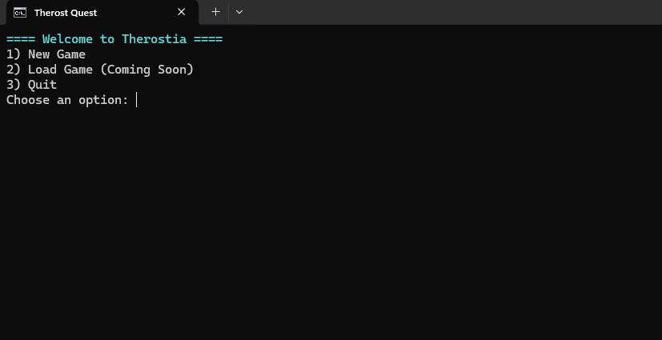
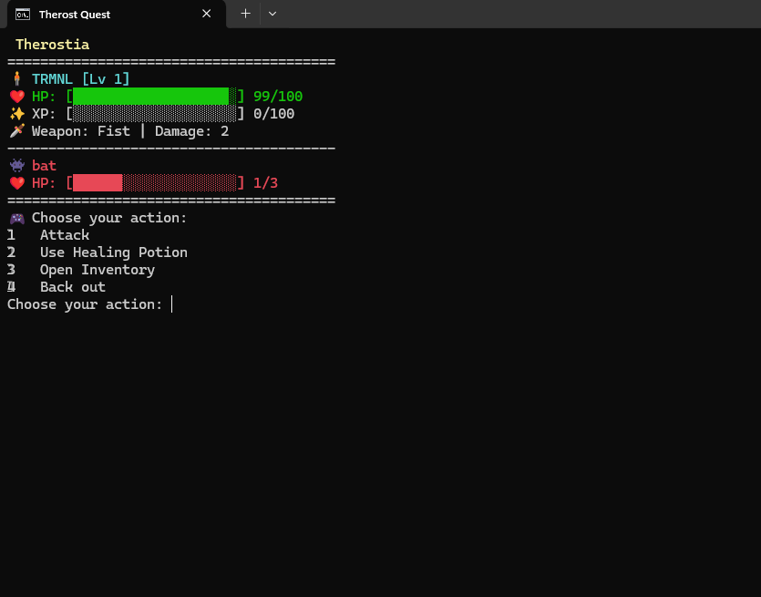
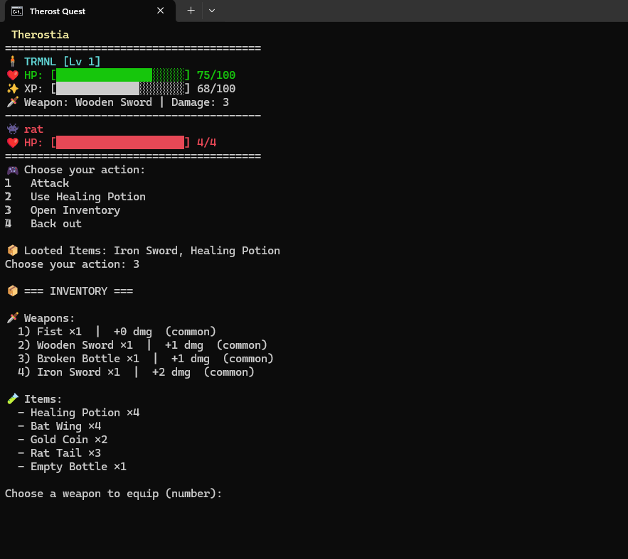

# Therostia Quest

Therostia Quest is a terminal-based RPG prototype written in Python. It features a simple combat loop, basic inventory management and a leveling system. The game data such as enemies, weapons and items are stored in JSON files making it easy to extend.

## How to Run

1. Ensure you have **Python 3.10+** installed.
2. From the project directory execute:

```bash
python main.py
```

On Windows you may also run `run.bat`.





## Current Features

- Character creation with starter equipment and items
- Turn based combat against randomly spawned enemies
- Basic leveling system with scaling enemy stats
- Inventory management with the ability to equip weapons and use healing potions
- Loot system that reads drops from JSON configuration
- Simple ASCII UI with health and experience bars

## Planned Features

The project is at an early stage. Upcoming features include:

- Saving and loading progress
- Crafting system
- Armor equipment
- Additional enemies including mini bosses and bosses
- PvE arena challenges
- Adventurers guild with a ranking system
- Story line quests
- Shop system for buying and selling items

Contributions and ideas are welcome!
